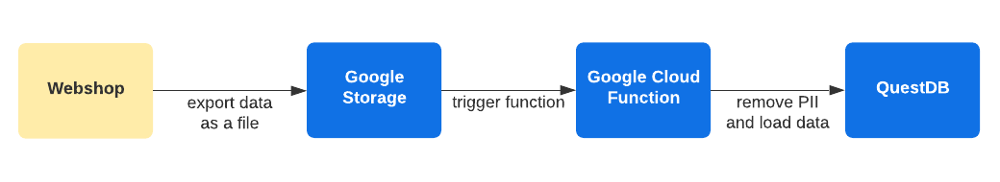
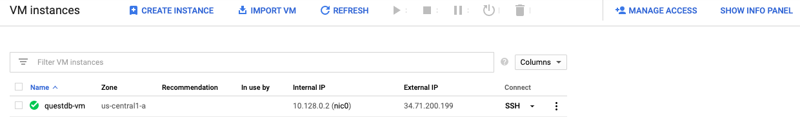
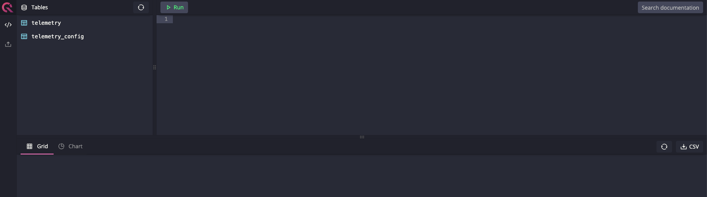
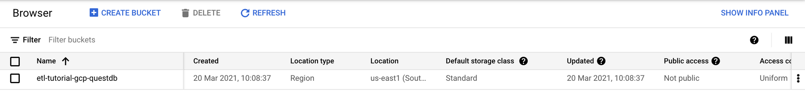
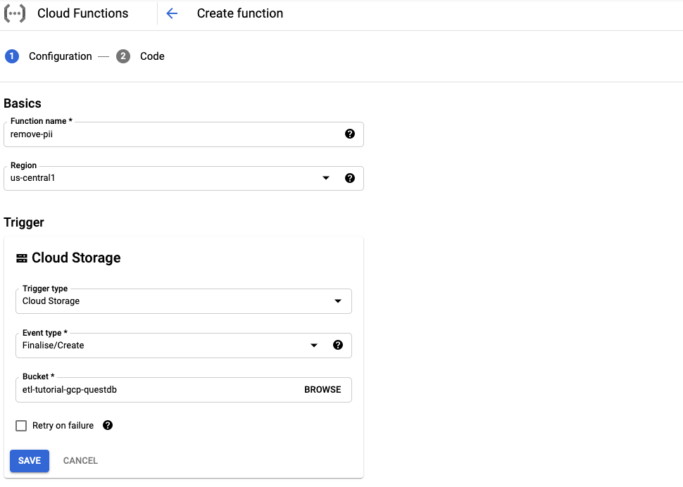
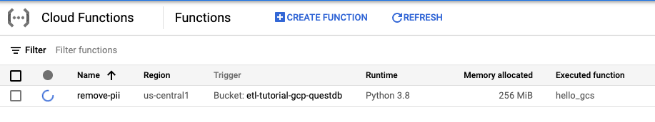
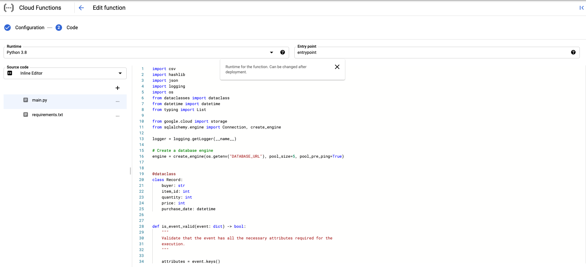
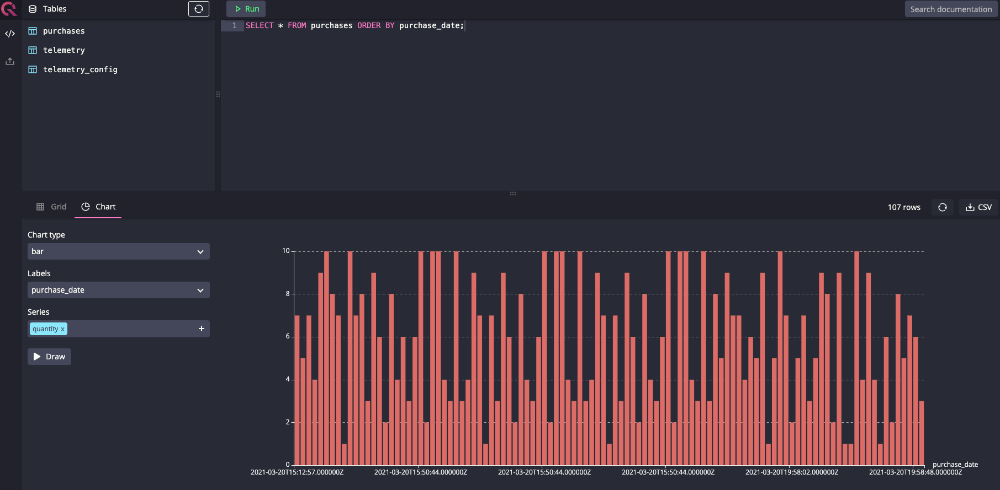

In the world of big data, software developers and data analysts often have to write scripts or complex software collections to Extract, Transform and Load data into a data store for further analysis or strategic planning. This process is referenced as ETL which stands for the data transformation described above.

## What could we use ETL jobs for?

Let's consider the following example: We are working at a medium-sized webshop that has few thousands of orders a day and the purchase data is exported hourly. After a while, we would like to visualize purchase trends and make the results public. Since the exported data contains personally identifiable information (PII), we would break GDPR if we wouldn't anonymize the data before using it or exposing it to the public.

For the example above, we can use an ETL job to extract the incoming data, remove any PII and load the transformed data into a database which will be used as the data visualization backend later.

## Create an ETL job

### Overview

In this tutorial, we will cover the scenario discussed above. As an intermediate data store where the data is exported by the webshop, we will use Google Storage and use Google Cloud Functions to transform the data before loading it into QuestDB.

Of course, we won't build a webshop or data exporter for an existing webshop, but a script that will simulate the export to Google Storage.

### Prerequisites

During this tutorial we will use Python to write the cloud functions, so basic python knowledge is essential, just as a [Google Cloud Platform](https://console.cloud.google.com/getting-started) (GCP) account and a GCP Project.

To complete this tutorial, you will need to enable the following APIs for your project on GCP. When enabling APIs **ensure that the desired GCP project is selected**.

- [Cloud Build API](https://console.cloud.google.com/marketplace/product/google/cloudbuild.googleapis.com) to deploy Cloud Functions

## Setting up the required components

In this section, we will set up the necessary components on GCP. Please ensure you enabled the required APIs mentioned in the prerequisites and you selected the GCP project in which you would like to create the resources.

### Create a virtual machine for QuestDB

First things first, we start with installing QuestDB on a virtual machine. To get started, navigate to the [VM instances console](https://console.cloud.google.com/compute/instances). Visiting this page for the first time will take some time. After the loading indicator disappeared, start a new virtual machine:

1. click on "create"
2. give a name to the instance, for example, `questdb-vm`
3. select a region close to you
4. select the first generation "N1" series
5. choose the f1-micro machine type - in a production environment you would choose a more performant instance, but for tutorial purposes, this is enough
6. below, at the "Firewall" section, click on "Management, security, disks, networking, sole tenancy"
7. on the newly appeared tabbed panel, select "Networking"
8. add `questdb` as a "Network tag"
9. leave other settings as is and click on "create" to create the VM
10. take a note about the "External IP" displayed in the list view, we will need that later

In some seconds, the new instance will be up and running. As soon as the instance is provisioned, we can initiate a connection to install QuestDB by clicking "ssh" in the row of the VM.

### Install QuestDB on the instance

Installing QuestDB on a Linux VM is easy. In the terminal shell opened by clicking "ssh" do the following:

1. run `curl -L -o questdb.tar.gz [https://github.com/questdb/questdb/releases/download/5.0.6.1/questdb-5.0.6.1-rt-linux-amd64.tar.gz](https://github.com/questdb/questdb/releases/download/5.0.6.1/questdb-5.0.6.1-rt-linux-amd64.tar.gz)` to download compressed binaries
2. create a directory for QuestDB by executing `sudo mkdir /usr/local/bin/questdb`
3. execute `sudo tar -xvf questdb.tar.gz -C /usr/local/bin/questdb` to extract the downloaded archive to the target location
4. finally, start QuestDB by running `sudo /usr/local/bin/questdb/questdb-5.0.6.1-rt-linux-amd64/bin/questdb.sh start`

In case of a successful start, you will see something like:

     / _ \ _   _  ___  ___| |_|  _ \| __ )
    | | | | | | |/ _ \/ __| __| | | |  _ \
    | |_| | |_| |  __/\__ \ |_| |_| | |_) |
     \__\_\\__,_|\___||___/\__|____/|____/
                            www.questdb.io
    JAVA: /usr/local/bin/questdb/questdb-5.0.6.1-rt-linux-amd64/bin/java
    Created QuestDB ROOT directory: /root/.questdb
    QuestDB server 5.0.6.1
    Copyright (C) 2014-2021, all rights reserved.

To validate that the database is started for sure, you can execute `sudo /usr/local/bin/questdb/questdb-5.0.6.1-rt-linux-amd64/bin/questdb.sh status
` which will return the process ID (PID) of the running process.

### Apply firewall rules on the new instance

If we try to open the interactive console by opening the `http://<EXTERNAL_IP>:9000` - where `<EXTERNAL_IP>` is the external IP of your virtual machine - it won't load and we will face a timeout. The reason behind this is that the firewall is not opened for port `9000`.

To allow port `9000` used by QuestDB, we must allow the port by adding a new firewall rule on the [firewall console](https://console.cloud.google.com/networking/firewalls/list):

1. click on "create firewall rule" at the top of the page
2. give it a name
3. in the "Target tags" field, write the same tag used for instance creation (`questdb`)
4. for the "Source IP ranges" field, set `0.0.0.0/0`
5. last but not least, at the "Protocols and ports" section, select "tcp" and set port to `9000,8812`
6. click on "create"

Some seconds later, the rule will be applied on every instance having the matching `questdb` tag and port `9000` will be opened. You may ask what is port `8812`; this port will be used by the Cloud Function later to connect to the database.

If you try to open the interactive console again, you should see the loaded console and you can start writing queries.

As our first query, create the table in which the Cloud Function will write the anonymized data. To create the table run the following SQL statement:

    CREATE TABLE
    	purchases(buyer STRING, item_id INT, quantity INT, price INT, purchase_date TIMESTAMP)
        timestamp(purchase_date);

### Create a Storage bucket

Now, we create the bucket where the simulated webshop data will be stored. Storage buckets are in a single global namespace in GCP, which means that the name of the bucket must be unique across all GCP customers. You can read more about Storage and buckets on Google's [documentation](https://cloud.google.com/storage/docs) site.

To create a new bucket:

1. navigate to the [cloud storage console](https://console.cloud.google.com/storage)
2. select your project if not selected yet
3. click on "create bucket"
4. choose a unique name for your storage
5. select the same region you selected for the instance above
6. leave other settings on default and click on "continue" to create the bucket

If you successfully created the bucket, it should show up in the storage browser as you can see below.

At this point, we don't set any permissions, ACLs, or visibility settings on the bucket, but we will get back to that later.

### Create a new Cloud Function

We have the bucket where the data will be uploaded, but we have nothing to process the data. To remove PII from the data, we will use Cloud Functions, as mentioned.

Cloud Functions is the functions as a service (FaaS) solution of GCP, similarly to AWS Lambdas. The functions are triggered by an event that can come from different sources. In our scenario Cloud Functions are handy since we don't need to pay for a server to run all day mostly idle; the function will be executed when the trigger event fired and we only pay for the execution time and the number of function calls.

To create a Cloud Function:

1. navigate to [cloud functions console](https://console.cloud.google.com/functions/list)
2. click on "create function"
3. choose a name for the function, for example, `remove-pii`
4. select the same region you selected for the instance above
5. for "Trigger" select "Cloud Storage" from the dropdown list
6. set the event type to "Finalise/Create"
7. choose the bucket you created above
8. click on "variables, networking, and advanced settings" button
9. select "environment variables" on the newly appeared tabbed panel
10. click on "add variable" right below the "Runtime environment variables" section
11. add a new variable called `DATABASE_URL` with the value `postgresql://admin:quest@<EXTERNAL_IP>:8812/qdb`, where `<EXTERNAL_IP>` is the external IP of your virtual machine
12. click on "save"
13. finally, at the bottom of the page, click on "next"

The next step is to select the runtime and write the function. On this page, we can choose between numerous runtimes, including multiple versions of Python, NodeJS, Go, Ruby, and even Java.

Since this tutorial is using Python, select Python 3.8 as it is the latest non-beta version at the time of writing. For now, don't modify the rest of the settings, we will write the function in the next section. Click "deploy" at the bottom of the page. Some seconds later, you will see that the deployment of the function is in progress.

The deployment may take a while. Until it completes, go on to the next section: creating the function which will process the data.

## Generating and processing data

Before moving on, a quick recap on what we did so far:

- Set up a new Google Storage bucket
- Created the Cloud Function which will process the data later on
- Connected the bucket with the function to trigger on a new object is created on the bucket

What's left? The fun part of the tutorial: writing the data processing script and loading the data in the database. Let's write the function to remove PII, but first, talk a bit about the structure of the data.

### Inspect the data structure

ETL jobs, by their nature, heavily depend on the structure of incoming data. A job may process multiple data sources and data structure can vary per source. To not load data into the data store, these jobs are validating the data before or after transformation but before loading it, depending on the use case.

The data structure we will use is simple. We have a CSV file with the following information: email address, purchased item's ID, quantity, the price per item, purchase date. As you see, there is no currency column since we will assume every price is in one currency.

To generate random data you can upload, you can use the [pre-made script](https://github.com/gabor-boros/questdb-etl-jobs/blob/e47b5f3191c8648f486cea207b317c92899c3bd1/data_generator.py) written for this tutorial.

### Create the data transformer function

By now, we have everything to write the data transformer function, connect the dots and try out the PII removal.

We will work in the "inline editor" of the cloud function, so as a first step, open the edit the cloud function created above by navigating to the [cloud functions console](https://console.cloud.google.com/functions/list) and clicking on the function's name. That will open the details of the function. At the top, click on "edit", then at the bottom click on "next" to open the editor.

Let's start with the requirements. On the left-hand side, click on the `requirements.txt` and paste the following:

    google-cloud-storage==1.36.2
    psycopg2==2.8.6
    sqlalchemy==1.4.2

Here we add the required packages to connect to Google Storage and QuestDB. Next, click on `main.py`, remove its whole content and start adding the following:

    import csv
    import hashlib
    import json
    import logging
    import os
    from dataclasses import dataclass
    from datetime import datetime
    from typing import List
    
    from google.cloud import storage
    from sqlalchemy.sql import text
    from sqlalchemy.engine import Connection, create_engine
    
    logger = logging.getLogger(__name__)
    
    # Create a database engine
    engine = create_engine(os.getenv("DATABASE_URL"))
    
    # ...

As you may expect, we start with the imports, but we added two extra lines: one for the logger and one for configuring the database engine. The logger will be needed to log warnings and exceptions during the execution, while we will use the engine later to insert anonymized data into the database.

To make our job easier later, we are going to add a data class, called `Record`. This data class will be used to store the parsed and anonymized CSV data for a line of the uploaded file.

    # ...
    
    @dataclass
    class Record:
        buyer: str
        item_id: int
        quantity: int
        price: int
        purchase_date: datetime
        
    # ...

As we discussed, ETL jobs are validating the data that they receive as input. In our case, the function will be triggered if an object is created on the storage. This means any kind of object, like a CSV, PDF, TXT, PNG file, or even a directory is created, though we only want to execute the transformation on CSV files. To validate the incoming data, we write two simple validator functions:

    # ...
    
    def is_event_valid(event: dict) -> bool:
        """
        Validate that the event has all the necessary attributes required for the
        execution.
        """
    
        attributes = event.keys()
        required_parameters = ["bucket", "contentType", "name", "size"]
    
        return all(parameter in attributes for parameter in required_parameters)
    
    
    def is_object_valid(event: dict) -> bool:
        """
        Validate that the finalized/created object is a CSV file and its size is
        greater than zero.
        """
    
        has_content = int(event["size"]) > 0
        is_csv = event["contentType"] == "text/csv"
    
        return has_content and is_csv
    
    # ...

The first function will validate that event has all the necessary parameters, while the second function checks that the object created and triggered the event is a CSV and has any content.

The next function we create is used to get an object from the storage which, in our case, the file triggered the event:

    # ...
    
    def get_content(bucket: storage.Bucket, file_path: str) -> str:
        """
        Get the blob from the bucket and return its content as a string.
        """
    
        blob = bucket.get_blob(file_path)
        return blob.download_as_string().decode("utf-8")
    
    # ...

Anonymizing the data, in this scenario, is relatively easy, though we need to ensure we can build statistics and visualizations later based on this data, so the anonymized parts should be consistent for a user. To achieve this, we will hash the buyer's email address, so it cannot be tracked back to the person owning the email, but we can use it for visualization:

    # ...
    
    def anonymize_pii(row: List[str]) -> Record:
        """
        Unpack and anonymize data.
        """
    
        email, item_id, quantity, price, purchase_date = row
    
        # Anonymize email address
        hashed_email = hashlib.sha1(email.encode()).hexdigest()
    
        return Record(
            buyer=hashed_email,
            item_id=int(item_id),
            quantity=int(quantity),
            price=int(price),
            purchase_date=purchase_date,
        )
    
    # ...

So far, we have functions to validate the data, get the file's content which triggered the Cloud Function, we can anonymize the data, so the next thing we need to be able to do is loading the data. Until this point every function we wrote was simple, this isn't an exception:

    # ...
    
    def write_to_db(conn: Connection, record: Record):
        """
        Write the records into the database.
        """
    
        query = """
        INSERT INTO purchases(buyer, item_id, quantity, price, purchase_date)
        VALUES(:buyer, :item_id, :quantity, :price, to_timestamp(:purchase_date, 'yyyy-MM-ddTHH:mm:ss'));
        """
    
        try:
            conn.execute(text(query), **record.__dict__)
        except Exception as exc:
            # If an error occures, log the exception and continue
            logger.exception("cannot write record", exc_info=exc)
    
    # ...

As you see, writing to the database is easy. We get the connection and the record we need to write into the database, prepare the query and execute it. In case of an exception, we don't want to block the whole processing, so we catch the exception, log it and let the script go on. If an exception happened, we can check it later and fix the script or load the data manually.

The last bit is the glue code, which brings together these functions. Have a look at that too:

    # ...
    
    def entrypoint(event: dict, context):
        """
        Triggered by a creation on a Cloud Storage bucket.
        """
    
        # Check if the event has all the necessary parameters. In case any of the
        # required parameters are missing, return early not to waste execution time.
        if not is_event_valid(event):
            logger.error("invalid event: %s", json.dumps(event))
            return
    
        file_path = event["name"]
    
        # Check if the created object is valid or not. In case the object is invalid
        # return early not to waste execution time.
        if not is_object_valid(event):
            logger.warning("invalid object: %s", file_path)
            return
    
        storage_client = storage.Client()
        bucket = storage_client.get_bucket(event["bucket"])
    
        data = get_content(bucket, file_path)
        reader = csv.reader(data.splitlines())
    
        # Anonymize PII and filter out invalid records
        records: List[Record] = filter(lambda r: r, [anonymize_pii(row) for row in reader])
    
        # Write the anonymized data to database
        with engine.connect() as conn:
            for record in records:
                write_to_db(conn, record)
    

What we did here? First, we call the two validators to ensure it worth processing the data, and we get the file path from the event. After that we initialize the client used to connect to Google Storage, then we get the object's content, parse the CSV file, and anonymizing the content of it.

Last but not least, we connect to the database - defined by the DATABASE_URL configured for the engine and write all records to the database one by one.

As you see, the entrypoint of the function has been changed as well. In the text box called "Entrypoint" set the entrypoint as a function name to call. The entrypoint is the function that will be called by Cloud Functions when an event is triggered.

## Connect the dots

We are close to finishing this tutorial, so it's time to test our Cloud Function. 

To test the Cloud Function:

1. download the [pre-made script](https://github.com/gabor-boros/questdb-etl-jobs/blob/e47b5f3191c8648f486cea207b317c92899c3bd1/data_generator.py) and run it to generate random data.
2. navigate to the bucket you created
3. above the list of objects in the bucket (which should be empty) click on "upload files"
4. select and upload the random generated data *1
5. after the file is uploaded, go to [Cloud Functions console](https://console.cloud.google.com/functions/list)
6. click on the actions button and select "view logs"
7. validate that the script did not encounter any issues
8. navigate to `http://<EXTERNAL_IP>:9000`, where `<EXTERNAL_IP>` is the external IP of your virtual machine
9. execute `SELECT * FROM purchases ORDER BY purchase_date;` SQL statement

As you can see, the data is loaded and we have no PII there. By creating a simple chart, we can even observe trends in the generated data, how our imaginary buyers purchased items on the webshop.

*1 QuestDB at the time of writing does not support "out of order" writes. This means you need to upload data with delay to let the previous function finish processing the data. Also, the uploaded purchase data must be in time order and increasing across the uploads. Example: We are uploading `data1.csv` and `data2.csv` the last generated purchase data in `data1.csv` is `2021-03-21T11:59:49`, therefor `data2.csv`'s first purchase order must be greater than or equal to `2021-03-21T11:59:49`.

## Summary

We've installed QuestDB on Google Cloud Platform, set up a Google Storage bucket to store the simulated purchase data exports, built an ETL job that anonymized our buyers' data, and loaded it into a time-series database, QuestDB. Data analysts could write more jobs as Cloud Functions in multiple languages and set up multiple sources. Furthermore, this data - as it does not contains PII anymore - could be loaded into a business intelligence (BI) dashboard like Power BI to have a more comprehensive overview of the data.

Thank you for your attention!

_The source code is available at [https://github.com/gabor-boros/questdb-etl-jobs](https://github.com/gabor-boros/questdb-etl-jobs)._
